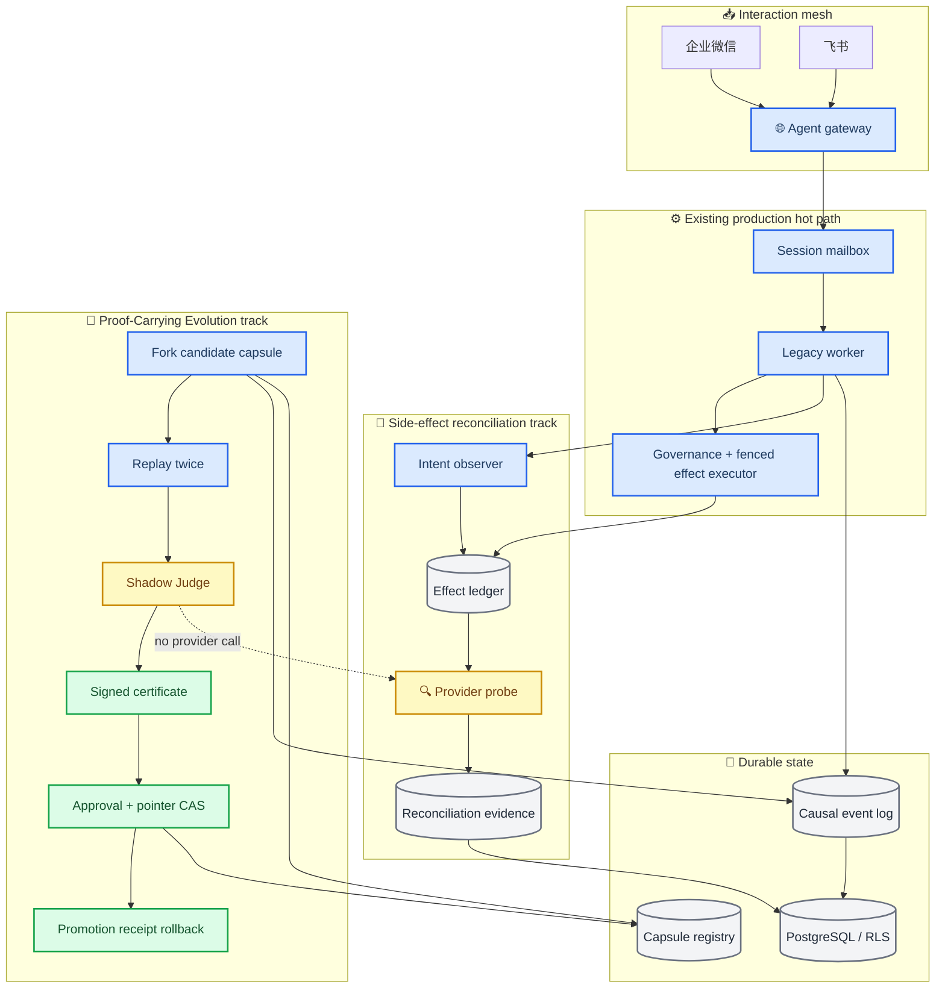
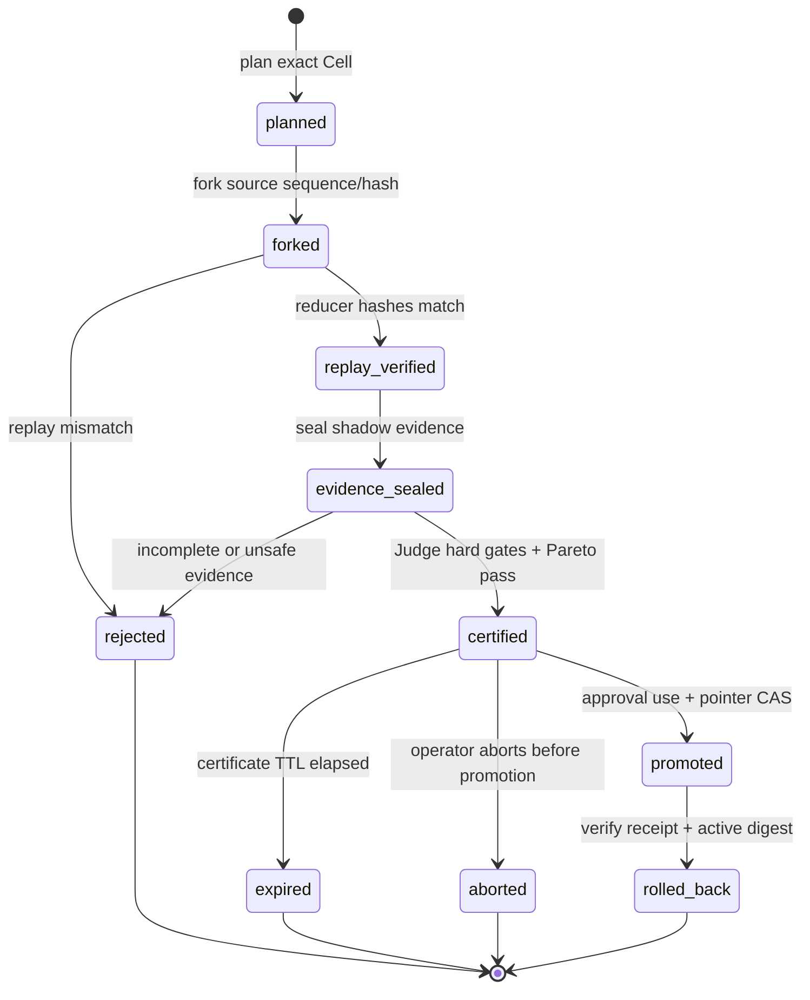
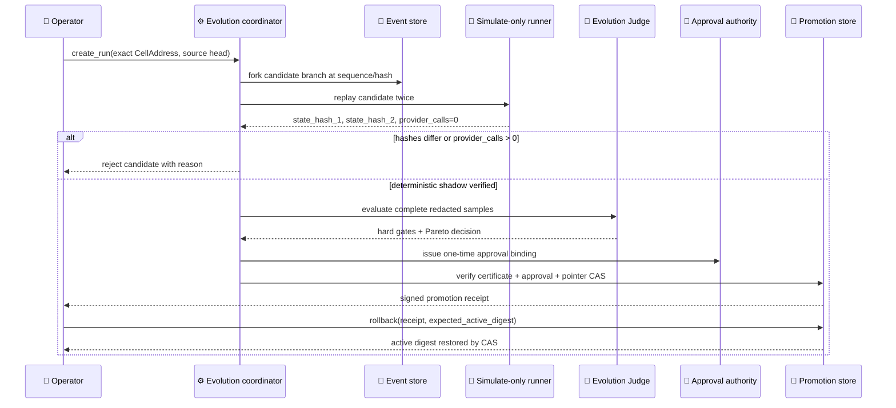

# Causal Agent Cell Fabric

## 1. 核心命题

本项目不再把 Agent 看成一次 HTTP 请求或一个常驻 Pod，而把它定义为可部署、可迁移、可暂停、
可回放、可分叉并可验证的逻辑运行单元 **Agent Cell**。平台保留原有多租户、IM、Mailbox、
Outbox、RLS、Fencing 和无状态 Worker 基础，在其上增加四个可独立验收的创新机制：

1. **Agent Capsule**：内容寻址、可签名的不可变 Agent 部署制品。
2. **Causal Event Kernel**：带 hash-chain、因果关系和分支身份的 Cell 事实日志。
3. **Intent / Effect Split**：Agent 只能提出工具意图，确定性执行面负责真实副作用。
4. **Replay & Evolution**：生产日志可确定性回放，并可从任意序号建立反事实候选分支。

创新不在于声称发明 Event Sourcing、Actor 或 A2A，而在于将这些思想落实到多租户 IM Agent 的
会话路由、跨节点恢复、工具副作用、Memory lineage、灰度发布和成本治理中，并提供可运行代码和
可量化的故障演示。

## 1.1 双轨渐进路线

本分支把创新拆成两个互不阻塞、都能在本机离线验收的闭环。默认 Worker 继续由已经验证的
legacy 执行链路负责真实运行；新能力先作为观察、影子或控制面流程接入，避免在没有独立
Effect Executor、真实 PostgreSQL 和供应商证据时制造双写或重复副作用。

| 轨道 | 本轮闭环 | 离线证据 | 生产边界 |
|---|---|---|---|
| 副作用对账 | `ambiguous` → 供应商只读查询 → `applied`/`not_applied`/`unknown` → Ledger CAS 收敛 | InMemory ledger、对账证据脱敏、并发/过期 attempt/冲突/跨租户拒绝测试 | `production=not_run`；不重新调用副作用接口，不启用 `cutover` |
| Proof-Carrying Evolution | fork → 双重 replay → `simulate_only` shadow → Judge → Ed25519 certificate → approval + pointer CAS → receipt rollback | `cell-evolve-demo`、稳定 evidence Merkle root、篡改/过期/跨租户/stale CAS 拒绝演示 | `production=not_run`；不使用真实模型、工具、KMS 或供应商凭据 |

配置默认是 `observe`：它只投影当前 legacy 决策和 effect key。显式 `shadow` 时，系统只构造并校验
native `ToolIntent`、namespace 与 effect key，仍不增加供应商调用。本轮没有 `cutover` 配置；只有
独立 effect 权威、真实 PostgreSQL/RLS、供应商对账和回滚证据全部具备后，才进入单独的发布评审。

## 2. Agent Cell 身份与不变量

```text
CellKey = tenant_id / app_id / cell_id / session_id / capsule_digest / branch_id
```

同一业务会话可以拥有多个分支，但 `main` 分支始终代表生产权威。Cell 不是 Worker：Worker 只是
临时宿主，Cell 可以在 lease 到期后由任意满足约束的节点重建。每个 Cell 保持以下不变量：

- 每个完整 `CellAddress(tenant_id, app_id, cell_id, session_id, capsule_digest, branch_id)` 的事件序号严格连续。
- 任意时刻最多一个有效的 `lease_owner + lease_epoch` 可以提交生产分支；Worker append 必须把
  Session/branch lease 的 owner、epoch、expiry 一起交给数据库 trigger，并由 `clock_timestamp()`
  校验。新建或 fork 的 branch head 使用 `NULL/0/NULL` 明确初始化，只有已锁定的当前 Session
  proof 能初始化或续租；提交后恢复投影没有 live lease，但必须有 committed turn + `reply.prepared`
  证据。
- Capsule digest 在一个 turn 内固定，重试不能漂移到其他 Prompt、模型或策略版本。
- `prev_hash → event_hash` 构成完整 hash-chain；payload 或顺序被修改时验证失败。
- 分支只能引用同租户、同 Cell 的祖先序号，不能跨租户继承上下文。
- 确定性回放不重新请求 LLM 或外部工具，只消费已经记录的响应事件。
- 反事实回放必须使用新 `branch_id`，不能覆盖生产事件。

## 3. 架构总览

题目要求的六个平台边界（Agent Gateway、Agent Worker、Channel Adapter、Storage Adapter、Admin
API、Telemetry Collector）在 [`architecture.md`](architecture.md) 的平台总图中展开；本节图聚焦
Cell 特有的控制/运行/信任/因果平面。



### 3.1 企业微信目标生产因果链路

下图是完成 Cell Scheduler 与原生 Intent/Effect 切换后的目标链路，不代表当前默认 Worker 已经过该
调度器或 `cell_effect_ledger` 执行工具。当前兼容热路径及差异在图后和 §9 明确列出。

```mermaid
sequenceDiagram
    accTitle: Cell Turn And Reconciliation
    accDescr: Target sequence for an inbound Cell turn showing the legacy worker boundary, one effect attempt, and read-only provider reconciliation after an ambiguous response.

    participant user as 企业微信用户
    participant connector as WeCom connector
    participant runtime as Tenant runtime
    participant postgres as PostgreSQL ledger
    participant worker as Legacy worker
    participant runner as tRPC-Agent runner
    participant executor as Effect executor
    participant provider as Provider
    participant reconciler as Provider reconciler
    participant dispatcher as Channel dispatcher

    user->>connector: aibot_msg_callback(provider_msg_id)
    connector->>runtime: verified envelope + binding_id
    runtime->>postgres: durable ingress + mailbox + outbox
    postgres-->>connector: commit acknowledged
    postgres->>worker: SessionReady wake-up
    worker->>postgres: claim session lease + hydrate head
    worker->>runner: run pinned capsule and branch
    runner->>postgres: append ToolIntent + policy decision
    postgres-->>executor: allowed intent + effect lease
    executor->>postgres: claim effect key, attempt 1
    executor->>provider: invoke side effect once
    alt provider response is known
        provider-->>executor: success or explicit failure
        executor->>postgres: receipt + terminal effect fact
    else response is lost
        provider--x executor: transport timeout; result ambiguous
        executor->>postgres: mark attempt ambiguous
        reconciler->>provider: GET status by provider idempotency key
        Note over reconciler,provider: probe only; never repeat the side-effect request
        alt applied
            provider-->>reconciler: applied
            reconciler->>postgres: CAS ambiguous → succeeded
        else not applied
            provider-->>reconciler: not_applied
            reconciler->>postgres: CAS ambiguous → failed; retry may be explicit
        else unknown
            provider-->>reconciler: unknown
            reconciler->>postgres: keep unknown; automatic retry remains blocked
        end
    end
    postgres->>dispatcher: outbound ready(trace_id, request_id)
    dispatcher->>connector: channel-normalized reply
    connector-->>user: aibot_send_msg + provider ACK
```

`trace_id` 从已验证入口生成或继承，`request_id` 标识本次接入，`correlation_id` 标识用户目标，
`causation_id` 连接相邻事件；四者职责不同，不能只用一个随机 ID 代替。

当前默认链路由 Redis `SessionReady` 直接唤醒 Mailbox Worker；真实 tRPC-Agent Runner 仍通过既有
`GovernancePipeline + ToolExecutor + PostgresExecutionLedger` 执行。`CellTurnJournal` 使用同一 Session
owner/epoch 投影 SDK Event、Tool Intent/decision 和 legacy execution key，Session commit 后再由
`post_turn.ready` Projector 修复缺失的 effect/turn terminal 事实。数据库 trigger 对前者强制当前
Session lease proof，对后者强制 `session_turns=committed + reply.prepared` proof；Worker 不能直接更新
Cell/head 绕过该边界。它证明创新层已经接到真实执行边界，但不把兼容桥接冒充为目标原生执行面。

## 4. Agent Capsule

Capsule 是控制面发布的最小部署制品。当前 `trpc_service.cell.capsule` API 使用冻结的 Pydantic
模型和 camelCase 别名序列化；它不解析或保存 Secret，只保存外部引用。`graph`、`prompt`、
`modelPolicy`、`toolManifest`、`governancePolicy`、`storageProfile` 和可选的 `knowledgeSnapshot`
是非空字符串引用。为兼容离线历史样例，模型层只做非空校验；Registry 的严格入口应调用
`CapsuleSpec.asset_ref()` 或 `validate_asset_refs()`，将引用解析为 `AssetRef(kind="digest")`
（完整 `sha256:<64 位小写 hex>`）或 `AssetRef(kind="logical")`（显式 `scheme://name`），再检查
制品存在和 checksum。`channelCapabilities` 会去空格、去重并排序，保证同义输入得到同一 canonical
bytes。

`canonical_bytes()`（也可由 `signing_bytes()` 取得）只覆盖 `apiVersion`、`kind`、`metadata` 和 `spec`，
使用 UTF-8、排序 key、无多余空白的 JSON；`compute_digest()` 对这些 bytes 做 SHA-256 并返回
`sha256:<64 位小写 hex>`。`sign()`
对同一 canonical bytes 生成 Ed25519 签名（签名不是对字符串化 digest 的二次签名），返回带 `digest`
和 `signature` 的新对象；`verify()` 先检查 digest，再用 `key_id → Ed25519PublicKey/32 字节公钥`
信任表校验签名。`verify()` 默认要求签名，开发态可显式 `require_signature=False`。`public_manifest()`
保留 digest 但省略 signature value，适合列表和日志。

当前 API 的最小序列化形状如下；`signature.value` 是 Ed25519 64 字节签名的 base64url 值：

```json
{
  "apiVersion": "agent.trpc.io/v1",
  "kind": "AgentCapsule",
  "metadata": {
    "tenant_id": "tenant-a",
    "name": "customer-service",
    "version": 3,
    "labels": {},
    "annotations": {}
  },
  "spec": {
    "graph": "graph://customer-service/v3",
    "prompt": "prompt://customer-service/v8",
    "modelPolicy": "model-policy://customer-service/v2",
    "toolManifest": "tool-manifest://customer-service/v4",
    "governancePolicy": "policy://customer-service/v8",
    "knowledgeSnapshot": "sha256:<64-hex>",
    "storageProfile": "enterprise-cn",
    "channelCapabilities": ["feishu.card", "wecom.markdown"],
    "slo": {
      "latency_budget_ms": 5000,
      "availability_target": 0.99,
      "priority": 50
    }
  },
  "digest": "sha256:<64-hex>",
  "signature": {
    "algorithm": "ed25519",
    "key_id": "platform-key-1",
    "value": "<base64url-64-byte-signature>"
  }
}
```

典型调用是 `signed = capsule.sign(private_key, key_id="platform-key-1")`，随后控制面以
`store.ensure_capsule(signed, trusted_keys={"platform-key-1": public_key})` 登记；PostgreSQL adapter 会
在调用特权 SQL 前再次验签，普通 `trpc_runtime` 与 `trpc_worker` 均无 deployment 登记权限。外层模型是
frozen 的，但 Python 内嵌
`labels/annotations` 字典仍应视为 copy-on-write；Registry 必须以 canonical 序列化结果入库并在
每次读取/调度前重新 `verify()`，不能把“frozen 外层”误当作深度不可变存储。灰度发布只移动租户的
active/candidate digest 指针；Inbox 接收消息时固定 digest，已开始的 Cell 不跟随控制面漂移。

## 5. 语义调度

Cell Scheduler 的输出必须可解释、可重复。满足硬约束后才计算当前实现的六个软评分分量；默认权重
已经归一化为 `0.28/0.20/0.15/0.12/0.12/0.13`：

```text
score = 0.28*slo
      + 0.20*locality
      + 0.15*capability
      + 0.12*compliance
      + 0.12*cost
      + 0.13*load
```

硬约束包括节点健康、draining、租户 allowlist、合规地域、必需能力、CPU/内存/Cell 并发和可选的
`max_cost_per_hour`。`preferred_capabilities`、数据局部性、preferred region、延迟、成本与负载
只参与评分；当前实现没有单独的 warm capsule cache 或 channel locality 分量。候选节点得分相同时
使用稳定 node ID 排序，确保调度测试可重复。调度结果同时输出逐项 score breakdown，避免成为不可
解释的第二个黑盒。`CellScheduler.place()` 只产生 advisory `PlacementDecision`；生产入口应调用
`place_and_reserve(..., PlacementReservationStore, owner_id=...)`，由持久化 reservation store 在事务
内重新检查容量并以 `lease_epoch` 抗并发超卖。续租和释放都必须回传调用方持有的 expected epoch；
即使 Worker 重启后复用了同一个 owner ID，旧 reservation 句柄也不能续租或释放新一代 lease。
reservation 冲突必须触发刷新节点快照和重新调度，不能把本地评分当作已占用资源。
reservation 表对普通租户启用 RLS，但为全局容量回收有意不 `FORCE`；只有表 owner 的受控
`SECURITY DEFINER` 调度函数能跨租户清理过期行，默认 Worker 没有 reservation 表 DML。

## 6. 因果事件协议

核心事件示例：

```text
message.accepted
→ cell.activated
→ context.projected
→ model.requested
→ model.responded
→ tool.intent.created
→ policy.decided
→ confirmation.received
→ tool.effect.committed
→ memory.fact.appended        # 目标原生 Memory lineage 事件
→ reply.prepared
→ reply.delivered
```

每个事件至少包含：

| 字段 | 作用 |
|---|---|
| tenant_id / app_id / cell_id / session_id / branch_id | 隔离及事件流身份 |
| capsule_digest | 精确运行版本 |
| sequence | 单分支连续顺序 |
| event_id | 全局事件身份 |
| causation_id | 直接导致本事件的上游事件 |
| correlation_id | 一次用户目标或业务任务 |
| trace_id | OpenTelemetry 链路关联 |
| prev_hash | 前一事件的 event_hash |
| payload_hash | canonical payload 的 SHA-256 |
| event_hash | 事件头、payload_hash 和 prev_hash 的联合摘要 |

当前 `cell_events` 是执行、治理和投递因果事实源；Memory/Summary 仍由独立事实表保存，其向量或外部
投影可最终一致重建，不允许向量结果反向覆盖事实。将 Memory fact 全量事件化并从 Cell log 重建
Memory/Summary 是目标切换项，不能由当前 Worker Journal 的执行事件推断为已经完成。

## 7. Intent / Effect Split（目标原生执行面）

Agent 和 LLM 不直接调用会产生外部副作用的工具。Tool adapter 首先建立不可变 `ToolIntent`：

```text
LLM tool call
  → ToolIntent(effect_key)
  → PolicyDecision
      ├─ deny
      ├─ require_confirmation
      ├─ simulate_only
      └─ allow
  → EffectExecutor
  → EffectReceipt(committed / failed / ambiguous / simulated)
```

`effect_key` 从 tenant、Cell、branch、intent ID、tool 和 arguments hash 确定性计算。执行器先原子保留
effect key，再调用供应商；相同 key 的重投只返回原 receipt。发送后超时或断线必须记为
`ambiguous`，禁止自动调用非幂等工具。确认令牌必须绑定 tenant、principal、Cell、tool、参数摘要和
过期时间，不能被其他租户或另一组参数复用。

Session lease 只授权产生并提交 Intent；Intent 与匹配的 `policy.decided` 因果事实持久化后，执行权通过
独立 effect lease 移交给执行面。PG completion 同时匹配 effect owner、attempt 和数据库时钟下未过期的
lease，旧执行者不能完成新 attempt。这样 Session 故障接管不会撤销已经授权且可能已发往供应商的
副作用，也不会把 Session epoch 误当成外部供应商的事务 ID。

仓库已经实现上述领域协议、内存/PG ledger 与一次性 approval adapter；离线 `cell-demo` 走原生协议。
PG 原生 ledger/approval 不授予默认跨租户 Worker 直接表权限，生产使用前需配置独立
`trpc_cell_executor` 身份并完成真实数据库/供应商门禁。迁移只在该角色已由运维单独 provision 时授予
Intent/Effect 所需最小权限；当前默认部署没有创建该身份，因此不能把 adapter 存在解读为在线启用。
默认 Worker 为降低切换风险，暂以真实 `GovernancePipeline` 决策、既有 fenced Tool ledger 执行，并把其
稳定的 64 位 execution key 投影到 Cell 事件；原生 ledger 使用
`trpc-agent-effect/v1:<sha256>` 命名空间，两者在切换前不混写同一表。因此“重复 key 不重复外部副作用”的在线权威当前仍是
`tool_executions`，不是 `cell_effect_ledger`；原生切换需要真实供应商 ambiguous 对账门禁后再灰度。
因此 committed-turn 无租约路径中的 `tool.effect.*` 只表示受保护的投影事实，不是对
`cell_effect_ledger`/外部副作用的重新授权；默认 Worker 是受信投影边界，原生 ledger 仍由独立
executor 权威写入。

### 7.1 副作用对账闭环

副作用请求的 transport timeout 只产生 `ambiguous`，不会触发隐式重试。专用
`ProviderReconciler.probe(intent, receipt)` 只按供应商幂等键查询状态，并生成脱敏
`ReconciliationEvidence`；它绝不再次调用副作用接口。协调器把证据交给
`EffectLedger.reconcile(intent, expected_attempt, evidence)`，并用 attempt、tenant 和状态条件做
CAS：

| 查询结果 | Ledger 收敛 | 后续动作 |
|---|---|---|
| `applied` | `ambiguous/unknown` → `succeeded` | 不再重试 |
| `not_applied` | `ambiguous/unknown` → `failed` | 仅在安全条件下允许显式重试 |
| `unknown` | 保持 `unknown` | 自动重试继续禁止，等待下一次查询或人工处置 |

`cell_effect_reconciliations` 是不可变证据表，只保存 effect key、attempt、结果、证据摘要、trace、
时间和对账器身份；不保存原始参数、密钥或供应商敏感响应。过期 attempt、跨租户 intent、重复
消费和互相冲突的证据全部拒绝。内存实现用于本机验收，PostgreSQL adapter 的 RLS、专用 authority
角色和 trigger 是生产切换前的独立门禁。

默认模式为 `observe`：真实 Worker 仍由 `GovernancePipeline + ToolExecutor +
PostgresExecutionLedger` 执行，新的对账器只观察并收敛可确认状态。`shadow` 只构造并校验 native
`ToolIntent`、namespace 和 effect key，不增加供应商调用；本轮不提供 `cutover`，因此不会产生两套
执行器同时写入或重复发送。

## 8. Replay、分支与演化

### 8.1 确定性回放

读取一个分支的事件，验证 sequence、prev_hash、payload_hash 和 event_hash，再通过纯 reducer
重建状态。该模式使用历史 `model.responded` 和 `tool.effect.*` 事件，不重新访问外部服务，适合事故
复盘、审计和投影校验。

### 8.2 反事实分支

从生产分支的序号 N 创建候选分支，复制的是 ancestry 引用和状态，不覆盖历史事件。候选分支可替换
Capsule、模型或策略并继续产生新事件，用于回答：

- 新模型是否减少成本而保持质量？
- 新 Prompt 是否提出了更多危险工具意图？
- 新策略是否正确阻断或要求确认？
- 新向量模型是否改变了检索来源？

候选结果通过 Quality、Cost、Latency、Safety Judge 后才进入按租户灰度。生产升级仍由人工或明确的
发布策略批准，Replay 系统不能自行获得更高权限。

### 8.3 Proof-Carrying Evolution 闭环

演进运行只接受完整的精确 `CellAddress`，v1 不支持 session/app wildcard。它从 main 的指定
sequence/hash 建立新 Capsule 分支；候选运行强制 `simulate_only`，真实 provider 调用数必须为零。
同一 reducer 回放两次并比较 state hash，任何不一致立即拒绝。每个样本只保存脱敏摘要和整数指标：
quality basis points、cost units、latency milliseconds、safety findings，以及 baseline/candidate
output hash；稳定排序后计算 evidence Merkle root。



Judge 先执行硬门禁：样本完整、无高危安全问题、无真实副作用、质量/成本/延迟均未超过策略退化
阈值；随后执行 Pareto 规则，至少一个指标严格改善。`EvolutionCertificate` 是 canonical JSON 的
Ed25519 签名，绑定完整 source/candidate `CellAddress`、Capsule 与 head、fork sequence/hash、
dataset、runner、model、policy、tool manifest、reducer、evidence digest、Judge 策略、key、有效期、
expected active Capsule 和 control version。证书只证明候选证据，不授权工具副作用。

Promotion 同时要求证书验证、租户范围一致、一次性人工 approval 和 pointer CAS；发布事件与 pointer
不能原子提交时由 outbox/reconciler 补偿，重复消费证书必须是幂等的。回滚使用签名 promotion receipt，
先校验当前 active digest 与 receipt，再以 CAS 恢复 expected Capsule；stale pointer、重复 approval、
错误 Capsule、跨租户或过期证书都必须拒绝。当前 `PromotionStore`、outbox 与 reconciler 是可完整运行的
进程内参考实现；`0025` 只提供 RLS/authority 数据边界，尚未实现 PostgreSQL CAS/outbox adapter，因而
不能据此宣称在线发布控制面已经生产可用。



## 9. 与现有实现的衔接

### 9.1 tRPC-Agent 直接复用与平台新增边界

| 类型 | 能力 |
|---|---|
| 直接复用 tRPC-Agent-Python | `Runner`、`BaseAgent`、`Event`、`AgentContext`、Session/Memory Service 接口、Graph/Team 编排、Tool/MCP、Tool Safety、Knowledge、A2A、AG-UI、OpenTelemetry hook |
| 本平台适配（当前默认） | 在真实 Worker turn 边界绑定 tenant/app/session/principal/binding/capsule/branch/trace；将 SDK Event 与治理 Tool boundary 投影为 causal event；以 Session fence 保护 pre-commit append；用 `post_turn.ready` 修复 commit/effect 投影 |
| 本平台新增（已实现核心/适配器） | Capsule/信任等级、Causal Event Store、branch head CAS、Intent/Approval/Effect 协议、placement reservation、Replay/Branch，以及对应内存与 PostgreSQL adapter |
| 目标切换项（非默认） | Semantic Cell Scheduler 接管 SessionReady、原生 Policy Authority/Cell Effect Executor、生产 KMS Registry、Quality Judge、批量 Evolution 发布 |

平台不重写 tRPC-Agent 的模型推理、Graph 编排或工具协议；创新层解决的是这些能力进入多租户生产环境后
的部署身份、节点调度、因果状态、副作用安全和演化验证。

### 9.2 现有仓库演进映射

| 现有模块 | 保留能力 | Cell Fabric 增量 |
|---|---|---|
| `TenantRuntime` | binding 验证、tenant/session/request/trace、配置固定 | Worker 在 pinned config 后派生非授权 `runtime_projection` capsule digest |
| Session Mailbox | 单 Session 串行、lease、fencing、恢复 | 同一 owner/epoch 限制 Cell pre-commit append；不需要 sticky session |
| `TenantRunner` | tRPC-Agent Runner、Session/Memory/Knowledge 注入 | Worker journal 将真实 SDK Event 做脱敏因果投影 |
| `AgentWorker.CellTurnJournal` | 在真实 Worker/Runner turn 边界提供窄适配协议 | 先记录 causal ingress/SDK/reply，再在 Session commit 后投影 terminal fact |
| `GovernancePipeline` | 默认在线白名单、安全、预算、确认、审计权威 | Observer 记录 ToolIntent、decision 与 legacy effect key；尚未由原生 Policy Authority 取代 |
| Tool Execution | 默认由 fenced `PostgresExecutionLedger` 保存幂等键和结果 | 将 execution key 投影成 Cell effect；原生 Cell EffectExecutor 仅离线/可选路径 |
| Session Events / Outbox | 权威事务提交和可靠投递 | 独立 Cell hash-chain；`post_turn.ready` 提供无 Agent 重放的 crash-window 修复 |
| Projector | Memory/Knowledge 最终一致投影 | 当前补齐 Cell effect/turn terminal；branch lineage/checksum 重建仍是演进目标 |
| Config Revision | 不可变灰度和回滚 | 内容寻址 Agent Capsule |

### 9.3 证据分层与基线合入

验收报告必须把代码存在、离线闭环和真实运行态分开写。`scripts/local_innovation_gate.py` 只做
本机证据编排，不把缺失的外部依赖或未执行的生产动作填成成功。

| 证据层 | 当前权威 | 可以宣称 | 不能宣称 |
|---|---|---|---|
| 生产热路径 | legacy `TenantRuntime`、Mailbox、`GovernancePipeline`、fenced `ToolExecutor`、`CellTurnJournal` | 现有多租户消息与 effect 投影边界保持不变 | 原生 Cell Effect Executor 已接管默认 Worker |
| 离线完整实现 | InMemory/纯函数协议、shadow Judge、证书与 Promotion store、`cell-demo`/`cell-evolve-demo`、local gate | 协议、拒绝条件、确定性与零真实副作用可在本机复现 | 真实 PG 锁/RLS、供应商语义、KMS 或多节点恢复已经通过 |
| 生产证据 | 本机未连接真实 IM、模型、供应商、KMS、PG 或 Kubernetes | `production=not_run` 及明确拒绝原因 | 用离线 `pass`、静态 SQL 或 mock 报告升级为生产通过 |

两个创新轨道应按边界分块合入稳定基线：

| 分块 | 建议 | 合入条件 |
|---|---|---|
| Effect reconciliation | 应合入；先以 `observe`，再以独立 reconciler/authority 部署 | InMemory 与 PG/RLS CAS、真实供应商 query-only 对账、重复/冲突/恢复证据齐全 |
| Proof-Carrying Evolution | 应以控制面/离线工具合入；候选分支和证书不改变默认 Worker | reducer、Judge、Ed25519、approval 一次性消费、pointer CAS/outbox/rollback 的完整证据齐全 |
| Native `cutover` | 本轮不合入 | 独立 Effect Executor、真实 PostgreSQL、供应商合同与灰度回滚门禁另行批准 |

交付保存为两个提交：第一个只包含既有 import 修复；第二个包含本双轨创新实现、gate、测试和文档。
后续合入 main 时仍按上表拆成可回滚的 pull request，不把离线创新演示与生产切换绑定。

## 10. 可演示验收场景

1. 注册并验证一个签名 Capsule，篡改 manifest 后验证必须失败。
2. 两个租户使用相同模型但不同地域/工具策略，Scheduler 输出不同节点和可解释评分。
3. Worker 在非幂等 Effect 返回前崩溃，接管节点看到同一 effect key，不进行第二次外部调用。
4. 对同一 `ambiguous` attempt 分别查询 `applied`、`not_applied` 和 `unknown`，验证 CAS 收敛、
   安全重试和持续封锁；供应商执行次数始终为一次。
5. 修改历史 event payload，hash-chain 校验立即失败。
6. 从生产 sequence 建立候选 branch，分别用两个 Capsule 继续运行，主分支不受影响。
7. Replay 重建状态两次并比较 state hash；候选运行的 provider call count 必须为零。
8. 让 Judge 逐项拒绝不完整样本、高危安全问题、真实副作用、超阈值退化和无严格改善的候选。
9. 篡改 evidence、跨租户、过期、错误 Capsule、重复 approval 和 stale pointer 均不能签发或发布；
   有效 Promotion receipt 可验证当前 active digest 后回滚。
10. `local_innovation_gate` 输出 git SHA、source fingerprint、每项 case result、
    `offline/development=pass` 和 `production=not_run`。
11. trace_id 串联 IM 入站、Cell 调度、Runner、Intent、Effect、投影和 IM 回复。

第 11 项是目标生产验收：当前 Feishu HTTP callback 已建立入口 span，WeCom 入站及完整存储子 span 仍需
真实 OTel 运行态验证，生产矩阵保持 `not_run`。

## 11. 量化指标

| 指标 | 目标 |
|---|---:|
| 历史事件确定性 replay checksum | 100% 一致 |
| 重复 effect_key 的外部副作用次数 | 1 |
| Worker 故障后的 Cell 恢复 | 不丢事件、不接受旧 epoch 提交 |
| 跨租户 branch/capsule/event 读取 | 0 |
| 调度硬约束违规 | 0 |
| Capsule 篡改检出 | 100% |
| 候选 Capsule 影子执行污染主分支 | 0 |

## 12. 交付边界

本仓库提供核心领域模型、确定性内存实现、既有 Cell PostgreSQL schema/adapter、默认 Worker 的 PostgreSQL
`CellTurnJournal`、Session-fenced append、`post_turn.ready` commit reconciler、CLI 演示与单元/契约测试。
Worker 只能登记不可调度的 `runtime_projection` Capsule；可授权 placement 的 `deployment` Capsule 仍需
生产控制面/KMS 验签与独立登记凭证。`scripts/local_innovation_gate.py` 是本机创新验收入口，默认
只加载本地 lineage 与可用的演进 demo hook；它不启动服务、不访问网络，也不改变生产指针。

生产接入继续复用原有 Gateway、Mailbox Worker、Outbox 和 Channel Dispatcher。Semantic Scheduler 与
容量 reservation、原生 Policy/Approval/Effect adapter 虽已实现，但尚未接管默认 Worker 热路径；外部
KMS 信任根、真实多节点调度状态、模型质量 Judge 和生产回放批处理也未在本地环境完成验证。副作用
对账和 Proof-Carrying Evolution 的离线拒绝路径可以由本地 gate/演示复现；真实供应商 query-only
语义、PG RLS/角色、PostgreSQL Promotion CAS/outbox adapter、KMS、IM、模型和发布恢复在验收矩阵中
保持 `production=not_run`，不能用离线
`cell-demo`、`cell-evolve-demo` 或静态 SQL 契约冒充生产通过。
