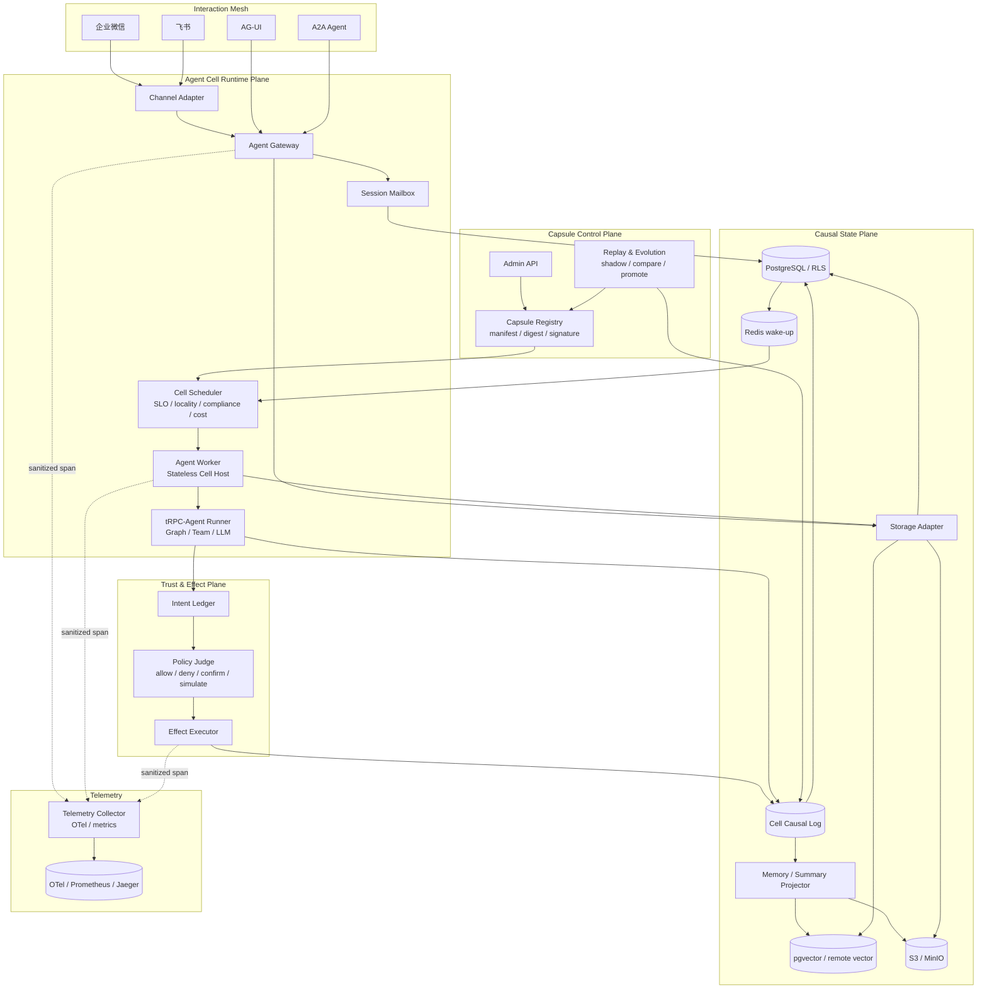
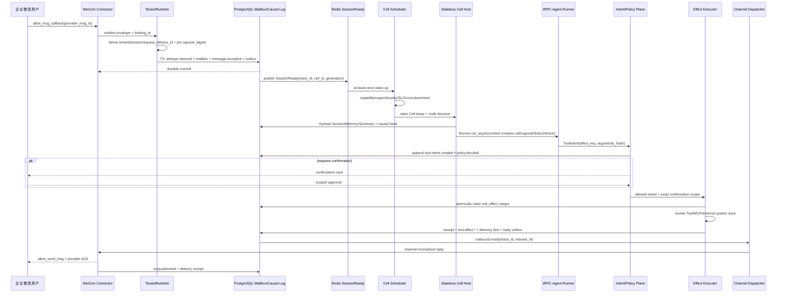

# Causal Agent Cell Fabric

## 1. 核心命题

本项目不再把 Agent 看成一次 HTTP 请求或一个常驻 Pod，而把它定义为可部署、可迁移、可暂停、
可回放、可分叉并可验证的逻辑运行单元 **Agent Cell**。平台保留原有多租户、IM、Mailbox、
Outbox、RLS、Fencing 和无状态 Worker 基础，在其上增加四个可独立验收的创新机制：

1. **Agent Capsule**：内容寻址、可签名的不可变 Agent 部署制品。
2. **Causal Event Kernel**：带 hash-chain、因果关系和分支身份的 Cell 事实日志。
3. **Intent / Effect Split**：Agent 只能提出工具意图，确定性执行面负责真实副作用。
4. **Replay & Evolution**：生产日志可确定性回放，并可从任意序号建立反事实候选分支。

创新不在于声称发明 Event Sourcing、Actor 或 A2A，而在于将这些思想落实到多租户 IM Agent 的
会话路由、跨节点恢复、工具副作用、Memory lineage、灰度发布和成本治理中，并提供可运行代码和
可量化的故障演示。

## 2. Agent Cell 身份与不变量

```text
CellKey = tenant_id / app_id / cell_id / session_id / capsule_digest / branch_id
```

同一业务会话可以拥有多个分支，但 `main` 分支始终代表生产权威。Cell 不是 Worker：Worker 只是
临时宿主，Cell 可以在 lease 到期后由任意满足约束的节点重建。每个 Cell 保持以下不变量：

- 每个完整 `CellAddress(tenant_id, app_id, cell_id, session_id, capsule_digest, branch_id)` 的事件序号严格连续。
- 任意时刻最多一个有效的 `lease_owner + lease_epoch` 可以提交生产分支；Worker append 必须把
  Session/branch lease 的 owner、epoch、expiry 一起交给数据库 trigger，并由 `clock_timestamp()`
  校验。新建或 fork 的 branch head 使用 `NULL/0/NULL` 明确初始化，只有已锁定的当前 Session
  proof 能初始化或续租；提交后恢复投影没有 live lease，但必须有 committed turn + `reply.prepared`
  证据。
- Capsule digest 在一个 turn 内固定，重试不能漂移到其他 Prompt、模型或策略版本。
- `prev_hash → event_hash` 构成完整 hash-chain；payload 或顺序被修改时验证失败。
- 分支只能引用同租户、同 Cell 的祖先序号，不能跨租户继承上下文。
- 确定性回放不重新请求 LLM 或外部工具，只消费已经记录的响应事件。
- 反事实回放必须使用新 `branch_id`，不能覆盖生产事件。

## 3. 架构总览

题目要求的六个平台边界（Agent Gateway、Agent Worker、Channel Adapter、Storage Adapter、Admin
API、Telemetry Collector）在 [`architecture.md`](architecture.md) 的平台总图中展开；本节图聚焦
Cell 特有的控制/运行/信任/因果平面。



### 3.1 企业微信目标生产因果链路

下图是完成 Cell Scheduler 与原生 Intent/Effect 切换后的目标链路，不代表当前默认 Worker 已经过该
调度器或 `cell_effect_ledger` 执行工具。当前兼容热路径及差异在图后和 §9 明确列出。



`trace_id` 从已验证入口生成或继承，`request_id` 标识本次接入，`correlation_id` 标识用户目标，
`causation_id` 连接相邻事件；四者职责不同，不能只用一个随机 ID 代替。

当前默认链路由 Redis `SessionReady` 直接唤醒 Mailbox Worker；真实 tRPC-Agent Runner 仍通过既有
`GovernancePipeline + ToolExecutor + PostgresExecutionLedger` 执行。`CellTurnJournal` 使用同一 Session
owner/epoch 投影 SDK Event、Tool Intent/decision 和 legacy execution key，Session commit 后再由
`post_turn.ready` Projector 修复缺失的 effect/turn terminal 事实。数据库 trigger 对前者强制当前
Session lease proof，对后者强制 `session_turns=committed + reply.prepared` proof；Worker 不能直接更新
Cell/head 绕过该边界。它证明创新层已经接到真实执行边界，但不把兼容桥接冒充为目标原生执行面。

## 4. Agent Capsule

Capsule 是控制面发布的最小部署制品。当前 `trpc_service.cell.capsule` API 使用冻结的 Pydantic
模型和 camelCase 别名序列化；它不解析或保存 Secret，只保存外部引用。`graph`、`prompt`、
`modelPolicy`、`toolManifest`、`governancePolicy`、`storageProfile` 和可选的 `knowledgeSnapshot`
是非空字符串引用。为兼容离线历史样例，模型层只做非空校验；Registry 的严格入口应调用
`CapsuleSpec.asset_ref()` 或 `validate_asset_refs()`，将引用解析为 `AssetRef(kind="digest")`
（完整 `sha256:<64 位小写 hex>`）或 `AssetRef(kind="logical")`（显式 `scheme://name`），再检查
制品存在和 checksum。`channelCapabilities` 会去空格、去重并排序，保证同义输入得到同一 canonical
bytes。

`canonical_bytes()`（也可由 `signing_bytes()` 取得）只覆盖 `apiVersion`、`kind`、`metadata` 和 `spec`，
使用 UTF-8、排序 key、无多余空白的 JSON；`compute_digest()` 对这些 bytes 做 SHA-256 并返回
`sha256:<64 位小写 hex>`。`sign()`
对同一 canonical bytes 生成 Ed25519 签名（签名不是对字符串化 digest 的二次签名），返回带 `digest`
和 `signature` 的新对象；`verify()` 先检查 digest，再用 `key_id → Ed25519PublicKey/32 字节公钥`
信任表校验签名。`verify()` 默认要求签名，开发态可显式 `require_signature=False`。`public_manifest()`
保留 digest 但省略 signature value，适合列表和日志。

当前 API 的最小序列化形状如下；`signature.value` 是 Ed25519 64 字节签名的 base64url 值：

```json
{
  "apiVersion": "agent.trpc.io/v1",
  "kind": "AgentCapsule",
  "metadata": {
    "tenant_id": "tenant-a",
    "name": "customer-service",
    "version": 3,
    "labels": {},
    "annotations": {}
  },
  "spec": {
    "graph": "graph://customer-service/v3",
    "prompt": "prompt://customer-service/v8",
    "modelPolicy": "model-policy://customer-service/v2",
    "toolManifest": "tool-manifest://customer-service/v4",
    "governancePolicy": "policy://customer-service/v8",
    "knowledgeSnapshot": "sha256:<64-hex>",
    "storageProfile": "enterprise-cn",
    "channelCapabilities": ["feishu.card", "wecom.markdown"],
    "slo": {
      "latency_budget_ms": 5000,
      "availability_target": 0.99,
      "priority": 50
    }
  },
  "digest": "sha256:<64-hex>",
  "signature": {
    "algorithm": "ed25519",
    "key_id": "platform-key-1",
    "value": "<base64url-64-byte-signature>"
  }
}
```

典型调用是 `signed = capsule.sign(private_key, key_id="platform-key-1")`，随后控制面以
`store.ensure_capsule(signed, trusted_keys={"platform-key-1": public_key})` 登记；PostgreSQL adapter 会
在调用特权 SQL 前再次验签，普通 `trpc_runtime` 与 `trpc_worker` 均无 deployment 登记权限。外层模型是
frozen 的，但 Python 内嵌
`labels/annotations` 字典仍应视为 copy-on-write；Registry 必须以 canonical 序列化结果入库并在
每次读取/调度前重新 `verify()`，不能把“frozen 外层”误当作深度不可变存储。灰度发布只移动租户的
active/candidate digest 指针；Inbox 接收消息时固定 digest，已开始的 Cell 不跟随控制面漂移。

## 5. 语义调度

Cell Scheduler 的输出必须可解释、可重复。满足硬约束后才计算当前实现的六个软评分分量；默认权重
已经归一化为 `0.28/0.20/0.15/0.12/0.12/0.13`：

```text
score = 0.28*slo
      + 0.20*locality
      + 0.15*capability
      + 0.12*compliance
      + 0.12*cost
      + 0.13*load
```

硬约束包括节点健康、draining、租户 allowlist、合规地域、必需能力、CPU/内存/Cell 并发和可选的
`max_cost_per_hour`。`preferred_capabilities`、数据局部性、preferred region、延迟、成本与负载
只参与评分；当前实现没有单独的 warm capsule cache 或 channel locality 分量。候选节点得分相同时
使用稳定 node ID 排序，确保调度测试可重复。调度结果同时输出逐项 score breakdown，避免成为不可
解释的第二个黑盒。`CellScheduler.place()` 只产生 advisory `PlacementDecision`；生产入口应调用
`place_and_reserve(..., PlacementReservationStore, owner_id=...)`，由持久化 reservation store 在事务
内重新检查容量并以 `lease_epoch` 抗并发超卖。续租和释放都必须回传调用方持有的 expected epoch；
即使 Worker 重启后复用了同一个 owner ID，旧 reservation 句柄也不能续租或释放新一代 lease。
reservation 冲突必须触发刷新节点快照和重新调度，不能把本地评分当作已占用资源。
reservation 表对普通租户启用 RLS，但为全局容量回收有意不 `FORCE`；只有表 owner 的受控
`SECURITY DEFINER` 调度函数能跨租户清理过期行，默认 Worker 没有 reservation 表 DML。

## 6. 因果事件协议

核心事件示例：

```text
message.accepted
→ cell.activated
→ context.projected
→ model.requested
→ model.responded
→ tool.intent.created
→ policy.decided
→ confirmation.received
→ tool.effect.committed
→ memory.fact.appended        # 目标原生 Memory lineage 事件
→ reply.prepared
→ reply.delivered
```

每个事件至少包含：

| 字段 | 作用 |
|---|---|
| tenant_id / app_id / cell_id / session_id / branch_id | 隔离及事件流身份 |
| capsule_digest | 精确运行版本 |
| sequence | 单分支连续顺序 |
| event_id | 全局事件身份 |
| causation_id | 直接导致本事件的上游事件 |
| correlation_id | 一次用户目标或业务任务 |
| trace_id | OpenTelemetry 链路关联 |
| prev_hash | 前一事件的 event_hash |
| payload_hash | canonical payload 的 SHA-256 |
| event_hash | 事件头、payload_hash 和 prev_hash 的联合摘要 |

当前 `cell_events` 是执行、治理和投递因果事实源；Memory/Summary 仍由独立事实表保存，其向量或外部
投影可最终一致重建，不允许向量结果反向覆盖事实。将 Memory fact 全量事件化并从 Cell log 重建
Memory/Summary 是目标切换项，不能由当前 Worker Journal 的执行事件推断为已经完成。

## 7. Intent / Effect Split（目标原生执行面）

Agent 和 LLM 不直接调用会产生外部副作用的工具。Tool adapter 首先建立不可变 `ToolIntent`：

```text
LLM tool call
  → ToolIntent(effect_key)
  → PolicyDecision
      ├─ deny
      ├─ require_confirmation
      ├─ simulate_only
      └─ allow
  → EffectExecutor
  → EffectReceipt(committed / failed / ambiguous / simulated)
```

`effect_key` 从 tenant、Cell、branch、intent ID、tool 和 arguments hash 确定性计算。执行器先原子保留
effect key，再调用供应商；相同 key 的重投只返回原 receipt。发送后超时或断线必须记为
`ambiguous`，禁止自动调用非幂等工具。确认令牌必须绑定 tenant、principal、Cell、tool、参数摘要和
过期时间，不能被其他租户或另一组参数复用。

Session lease 只授权产生并提交 Intent；Intent 与匹配的 `policy.decided` 因果事实持久化后，执行权通过
独立 effect lease 移交给执行面。PG completion 同时匹配 effect owner、attempt 和数据库时钟下未过期的
lease，旧执行者不能完成新 attempt。这样 Session 故障接管不会撤销已经授权且可能已发往供应商的
副作用，也不会把 Session epoch 误当成外部供应商的事务 ID。

仓库已经实现上述领域协议、内存/PG ledger 与一次性 approval adapter；离线 `cell-demo` 走原生协议。
PG 原生 ledger/approval 不授予默认跨租户 Worker 直接表权限，生产使用前需配置独立
`trpc_cell_executor` 身份并完成真实数据库/供应商门禁。迁移只在该角色已由运维单独 provision 时授予
Intent/Effect 所需最小权限；当前默认部署没有创建该身份，因此不能把 adapter 存在解读为在线启用。
默认 Worker 为降低切换风险，暂以真实 `GovernancePipeline` 决策、既有 fenced Tool ledger 执行，并把其
稳定的 64 位 execution key 投影到 Cell 事件；原生 ledger 使用
`trpc-agent-effect/v1:<sha256>` 命名空间，两者在切换前不混写同一表。因此“重复 key 不重复外部副作用”的在线权威当前仍是
`tool_executions`，不是 `cell_effect_ledger`；原生切换需要真实供应商 ambiguous 对账门禁后再灰度。
因此 committed-turn 无租约路径中的 `tool.effect.*` 只表示受保护的投影事实，不是对
`cell_effect_ledger`/外部副作用的重新授权；默认 Worker 是受信投影边界，原生 ledger 仍由独立
executor 权威写入。

## 8. Replay、分支与演化

### 8.1 确定性回放

读取一个分支的事件，验证 sequence、prev_hash、payload_hash 和 event_hash，再通过纯 reducer
重建状态。该模式使用历史 `model.responded` 和 `tool.effect.*` 事件，不重新访问外部服务，适合事故
复盘、审计和投影校验。

### 8.2 反事实分支

从生产分支的序号 N 创建候选分支，复制的是 ancestry 引用和状态，不覆盖历史事件。候选分支可替换
Capsule、模型或策略并继续产生新事件，用于回答：

- 新模型是否减少成本而保持质量？
- 新 Prompt 是否提出了更多危险工具意图？
- 新策略是否正确阻断或要求确认？
- 新向量模型是否改变了检索来源？

候选结果通过 Quality、Cost、Latency、Safety Judge 后才进入按租户灰度。生产升级仍由人工或明确的
发布策略批准，Replay 系统不能自行获得更高权限。

## 9. 与现有实现的衔接

### 9.1 tRPC-Agent 直接复用与平台新增边界

| 类型 | 能力 |
|---|---|
| 直接复用 tRPC-Agent-Python | `Runner`、`BaseAgent`、`Event`、`AgentContext`、Session/Memory Service 接口、Graph/Team 编排、Tool/MCP、Tool Safety、Knowledge、A2A、AG-UI、OpenTelemetry hook |
| 本平台适配（当前默认） | 在真实 Worker turn 边界绑定 tenant/app/session/principal/binding/capsule/branch/trace；将 SDK Event 与治理 Tool boundary 投影为 causal event；以 Session fence 保护 pre-commit append；用 `post_turn.ready` 修复 commit/effect 投影 |
| 本平台新增（已实现核心/适配器） | Capsule/信任等级、Causal Event Store、branch head CAS、Intent/Approval/Effect 协议、placement reservation、Replay/Branch，以及对应内存与 PostgreSQL adapter |
| 目标切换项（非默认） | Semantic Cell Scheduler 接管 SessionReady、原生 Policy Authority/Cell Effect Executor、生产 KMS Registry、Quality Judge、批量 Evolution 发布 |

平台不重写 tRPC-Agent 的模型推理、Graph 编排或工具协议；创新层解决的是这些能力进入多租户生产环境后
的部署身份、节点调度、因果状态、副作用安全和演化验证。

### 9.2 现有仓库演进映射

| 现有模块 | 保留能力 | Cell Fabric 增量 |
|---|---|---|
| `TenantRuntime` | binding 验证、tenant/session/request/trace、配置固定 | Worker 在 pinned config 后派生非授权 `runtime_projection` capsule digest |
| Session Mailbox | 单 Session 串行、lease、fencing、恢复 | 同一 owner/epoch 限制 Cell pre-commit append；不需要 sticky session |
| `TenantRunner` | tRPC-Agent Runner、Session/Memory/Knowledge 注入 | Worker journal 将真实 SDK Event 做脱敏因果投影 |
| `AgentWorker.CellTurnJournal` | 在真实 Worker/Runner turn 边界提供窄适配协议 | 先记录 causal ingress/SDK/reply，再在 Session commit 后投影 terminal fact |
| `GovernancePipeline` | 默认在线白名单、安全、预算、确认、审计权威 | Observer 记录 ToolIntent、decision 与 legacy effect key；尚未由原生 Policy Authority 取代 |
| Tool Execution | 默认由 fenced `PostgresExecutionLedger` 保存幂等键和结果 | 将 execution key 投影成 Cell effect；原生 Cell EffectExecutor 仅离线/可选路径 |
| Session Events / Outbox | 权威事务提交和可靠投递 | 独立 Cell hash-chain；`post_turn.ready` 提供无 Agent 重放的 crash-window 修复 |
| Projector | Memory/Knowledge 最终一致投影 | 当前补齐 Cell effect/turn terminal；branch lineage/checksum 重建仍是演进目标 |
| Config Revision | 不可变灰度和回滚 | 内容寻址 Agent Capsule |

## 10. 可演示验收场景

1. 注册并验证一个签名 Capsule，篡改 manifest 后验证必须失败。
2. 两个租户使用相同模型但不同地域/工具策略，Scheduler 输出不同节点和可解释评分。
3. Worker 在非幂等 Effect 返回前崩溃，接管节点看到同一 effect key，不进行第二次外部调用。
4. 修改历史 event payload，hash-chain 校验立即失败。
5. 从生产 sequence 建立候选 branch，分别用两个 Capsule 继续运行，主分支不受影响。
6. Replay 重建状态并与存储的 projection checksum 比较。
7. 高风险 Intent 未确认时不执行；确认令牌跨租户或参数变化时拒绝。
8. trace_id 串联 IM 入站、Cell 调度、Runner、Intent、Effect、投影和 IM 回复。

第 8 项是目标生产验收：当前 Feishu HTTP callback 已建立入口 span，WeCom 入站及完整存储子 span 仍需
真实 OTel 运行态验证，生产矩阵保持 `not_run`。

## 11. 量化指标

| 指标 | 目标 |
|---|---:|
| 历史事件确定性 replay checksum | 100% 一致 |
| 重复 effect_key 的外部副作用次数 | 1 |
| Worker 故障后的 Cell 恢复 | 不丢事件、不接受旧 epoch 提交 |
| 跨租户 branch/capsule/event 读取 | 0 |
| 调度硬约束违规 | 0 |
| Capsule 篡改检出 | 100% |
| 候选 Capsule 影子执行污染主分支 | 0 |

## 12. 交付边界

本仓库提供核心领域模型、确定性内存实现、PostgreSQL schema/adapter、默认 Worker 的 PostgreSQL
`CellTurnJournal`、Session-fenced append、`post_turn.ready` commit reconciler、CLI 演示与单元/契约测试。
Worker 只能登记不可调度的 `runtime_projection` Capsule；可授权 placement 的 `deployment` Capsule 仍需
生产控制面/KMS 验签与独立登记凭证。

生产接入继续复用原有 Gateway、Mailbox Worker、Outbox 和 Channel Dispatcher。Semantic Scheduler 与
容量 reservation、原生 Policy/Approval/Effect adapter 虽已实现，但尚未接管默认 Worker 热路径；外部
KMS 信任根、真实多节点调度状态、模型质量 Judge 和生产回放批处理也未在本地环境完成验证。它们在验收
矩阵中保持 `not_run`，不能用离线 `cell-demo` 或静态 SQL 契约冒充生产通过。
