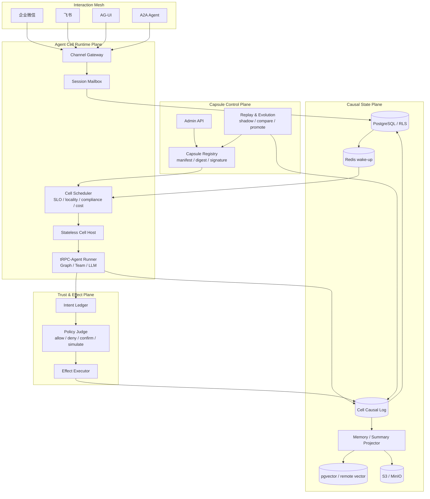
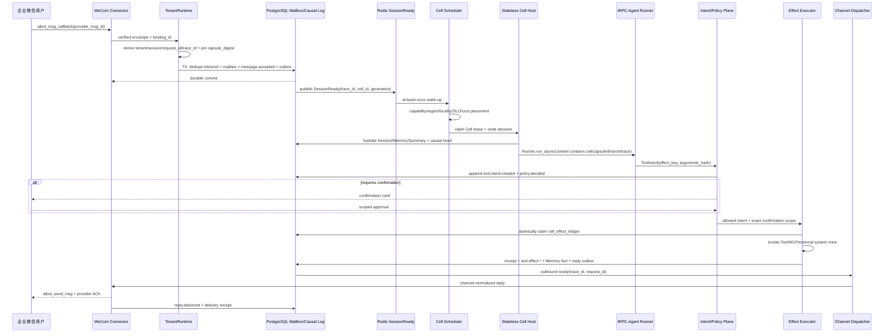

# Causal Agent Cell Fabric

## 1. 核心命题

本项目不再把 Agent 看成一次 HTTP 请求或一个常驻 Pod，而把它定义为可部署、可迁移、可暂停、
可回放、可分叉并可验证的逻辑运行单元 **Agent Cell**。平台保留原有多租户、IM、Mailbox、
Outbox、RLS、Fencing 和无状态 Worker 基础，在其上增加四个可独立验收的创新机制：

1. **Agent Capsule**：内容寻址、可签名的不可变 Agent 部署制品。
2. **Causal Event Kernel**：带 hash-chain、因果关系和分支身份的 Cell 事实日志。
3. **Intent / Effect Split**：Agent 只能提出工具意图，确定性执行面负责真实副作用。
4. **Replay & Evolution**：生产日志可确定性回放，并可从任意序号建立反事实候选分支。

创新不在于声称发明 Event Sourcing、Actor 或 A2A，而在于将这些思想落实到多租户 IM Agent 的
会话路由、跨节点恢复、工具副作用、Memory lineage、灰度发布和成本治理中，并提供可运行代码和
可量化的故障演示。

## 2. Agent Cell 身份与不变量

```text
CellKey = tenant_id / app_id / session_id / capsule_digest / branch_id
```

同一业务会话可以拥有多个分支，但 `main` 分支始终代表生产权威。Cell 不是 Worker：Worker 只是
临时宿主，Cell 可以在 lease 到期后由任意满足约束的节点重建。每个 Cell 保持以下不变量：

- 每个 `(tenant_id, cell_id, branch_id)` 的事件序号严格连续。
- 任意时刻最多一个有效的 `lease_owner + lease_epoch` 可以提交生产分支。
- Capsule digest 在一个 turn 内固定，重试不能漂移到其他 Prompt、模型或策略版本。
- `prev_hash → event_hash` 构成完整 hash-chain；payload 或顺序被修改时验证失败。
- 分支只能引用同租户、同 Cell 的祖先序号，不能跨租户继承上下文。
- 确定性回放不重新请求 LLM 或外部工具，只消费已经记录的响应事件。
- 反事实回放必须使用新 `branch_id`，不能覆盖生产事件。

## 3. 架构总览



### 3.1 企业微信完整因果链路



`trace_id` 从已验证入口生成或继承，`request_id` 标识本次接入，`correlation_id` 标识用户目标，
`causation_id` 连接相邻事件；四者职责不同，不能只用一个随机 ID 代替。

## 4. Agent Capsule

Capsule 是控制面发布的最小不可变制品。其 canonical JSON 不包含明文 Secret，只包含 SecretRef；
所有 map key 排序、无多余空白，然后计算 SHA-256 digest。可选签名覆盖 digest，而不是覆盖不稳定的
序列化文本。

```json
{
  "schema_version": "agent.trpc.io/v1",
  "tenant_id": "tenant-a",
  "name": "customer-service",
  "agent_graph": {"kind": "GraphAgent", "ref": "sha256:..."},
  "model_policy": {"primary": "model-a", "fallback": "model-b"},
  "tool_manifest": ["order.read", "refund.propose"],
  "governance_policy_ref": "policy://customer-service/v8",
  "knowledge_snapshot": "sha256:...",
  "storage_profile": "enterprise-cn",
  "required_capabilities": ["wecom", "tool-sandbox"],
  "allowed_regions": ["cn-shanghai"],
  "slo": {"p95_latency_ms": 5000, "max_cost_units": 8000}
}
```

同一 digest 在任意节点解析结果相同。灰度发布只移动租户的 active/candidate digest 指针；Inbox 接收
消息时固定 digest，已开始的 Cell 不跟随控制面漂移。

## 5. 语义调度

Cell Scheduler 的输出必须可解释、可重复。满足硬约束后才计算软评分：

```text
score = warm_capsule_cache
      + knowledge_locality
      + channel_locality
      + slo_headroom
      - normalized_load
      - estimated_cost
```

硬约束包括节点健康、Capsule 所需能力、租户允许地域、数据主权区域和最大并发。候选节点得分相同
时使用稳定 node ID 排序，确保调度测试可重复。调度结果同时输出逐项 score breakdown，避免成为不可
解释的第二个黑盒。

## 6. 因果事件协议

核心事件示例：

```text
message.accepted
→ cell.activated
→ context.projected
→ model.requested
→ model.responded
→ tool.intent.created
→ policy.decided
→ confirmation.received
→ tool.effect.committed
→ memory.fact.appended
→ reply.prepared
→ reply.delivered
```

每个事件至少包含：

| 字段 | 作用 |
|---|---|
| tenant_id / cell_id / branch_id | 隔离及事件流身份 |
| capsule_digest | 精确运行版本 |
| sequence | 单分支连续顺序 |
| event_id | 全局事件身份 |
| causation_id | 直接导致本事件的上游事件 |
| correlation_id | 一次用户目标或业务任务 |
| trace_id | OpenTelemetry 链路关联 |
| prev_hash | 前一事件的 event_hash |
| payload_hash | canonical payload 的 SHA-256 |
| event_hash | 事件头、payload_hash 和 prev_hash 的联合摘要 |

PostgreSQL `cell_events` 是事实源；Memory、Summary、成本、审计和搜索索引是投影。向量库丢失时可从
事实事件重建，不允许向量结果反向覆盖事实。

## 7. Intent / Effect Split

Agent 和 LLM 不直接调用会产生外部副作用的工具。Tool adapter 首先建立不可变 `ToolIntent`：

```text
LLM tool call
  → ToolIntent(effect_key)
  → PolicyDecision
      ├─ deny
      ├─ require_confirmation
      ├─ simulate_only
      └─ allow
  → EffectExecutor
  → EffectReceipt(committed / failed / ambiguous / simulated)
```

`effect_key` 从 tenant、Cell、branch、intent ID、tool 和 arguments hash 确定性计算。执行器先原子保留
effect key，再调用供应商；相同 key 的重投只返回原 receipt。发送后超时或断线必须记为
`ambiguous`，禁止自动调用非幂等工具。确认令牌必须绑定 tenant、principal、Cell、tool、参数摘要和
过期时间，不能被其他租户或另一组参数复用。

## 8. Replay、分支与演化

### 8.1 确定性回放

读取一个分支的事件，验证 sequence、prev_hash、payload_hash 和 event_hash，再通过纯 reducer
重建状态。该模式使用历史 `model.responded` 和 `tool.effect.*` 事件，不重新访问外部服务，适合事故
复盘、审计和投影校验。

### 8.2 反事实分支

从生产分支的序号 N 创建候选分支，复制的是 ancestry 引用和状态，不覆盖历史事件。候选分支可替换
Capsule、模型或策略并继续产生新事件，用于回答：

- 新模型是否减少成本而保持质量？
- 新 Prompt 是否提出了更多危险工具意图？
- 新策略是否正确阻断或要求确认？
- 新向量模型是否改变了检索来源？

候选结果通过 Quality、Cost、Latency、Safety Judge 后才进入按租户灰度。生产升级仍由人工或明确的
发布策略批准，Replay 系统不能自行获得更高权限。

## 9. 与现有实现的衔接

### 9.1 tRPC-Agent 直接复用与平台新增边界

| 类型 | 能力 |
|---|---|
| 直接复用 tRPC-Agent-Python | `Runner`、`BaseAgent`、`Event`、`AgentContext`、Session/Memory Service 接口、Graph/Team 编排、Tool/MCP、Tool Safety、Knowledge、A2A、AG-UI、OpenTelemetry hook |
| 本平台适配 | 将 tenant/cell/capsule/branch/trace 注入 Runner；将 SDK Event 转为 causal event；将 Tool call 转为 ToolIntent；将 Session/Memory 写入接入 fenced commit/projector |
| 本平台新增 | Capsule Registry、Cell Scheduler、Causal Event Store、Intent Ledger、Effect Executor、Replay/Branch/Evolution、IM binding 路由、多租户 RLS、可靠 Outbox 和发布门禁 |

平台不重写 tRPC-Agent 的模型推理、Graph 编排或工具协议；创新层解决的是这些能力进入多租户生产环境后
的部署身份、节点调度、因果状态、副作用安全和演化验证。

### 9.2 现有仓库演进映射

| 现有模块 | 保留能力 | Cell Fabric 增量 |
|---|---|---|
| `TenantRuntime` | binding 验证、tenant/session/request/trace、配置固定 | 固定 capsule digest，产生 `message.accepted` |
| Session Mailbox | 单 Session 串行、lease、fencing、恢复 | Cell 激活、迁移和 branch 身份 |
| `TenantRunner` | tRPC-Agent Runner、Session/Memory/Knowledge 注入 | 所有模型/工具输出转为因果事件 |
| `GovernancePipeline` | 白名单、安全、预算、确认、审计 | 成为 ToolIntent 的 Policy Judge |
| Tool Execution | 幂等键、结果持久化 | EffectExecutor 与不可变 receipt |
| Session Events / Outbox | 事务提交和可靠投递 | 统一 causal metadata 与 hash-chain |
| Projector | Memory/Knowledge 最终一致投影 | lineage、branch 和 projection checksum |
| Config Revision | 不可变灰度和回滚 | 内容寻址 Agent Capsule |

## 10. 可演示验收场景

1. 注册并验证一个签名 Capsule，篡改 manifest 后验证必须失败。
2. 两个租户使用相同模型但不同地域/工具策略，Scheduler 输出不同节点和可解释评分。
3. Worker 在非幂等 Effect 返回前崩溃，接管节点看到同一 effect key，不进行第二次外部调用。
4. 修改历史 event payload，hash-chain 校验立即失败。
5. 从生产 sequence 建立候选 branch，分别用两个 Capsule 继续运行，主分支不受影响。
6. Replay 重建状态并与存储的 projection checksum 比较。
7. 高风险 Intent 未确认时不执行；确认令牌跨租户或参数变化时拒绝。
8. trace_id 串联 IM 入站、Cell 调度、Runner、Intent、Effect、投影和 IM 回复。

## 11. 量化指标

| 指标 | 目标 |
|---|---:|
| 历史事件确定性 replay checksum | 100% 一致 |
| 重复 effect_key 的外部副作用次数 | 1 |
| Worker 故障后的 Cell 恢复 | 不丢事件、不接受旧 epoch 提交 |
| 跨租户 branch/capsule/event 读取 | 0 |
| 调度硬约束违规 | 0 |
| Capsule 篡改检出 | 100% |
| 候选 Capsule 影子执行污染主分支 | 0 |

## 12. 交付边界

本仓库提供核心领域模型、确定性内存实现、PostgreSQL schema、CLI 演示与单元测试。生产接入继续复用
原有 Gateway、Mailbox Worker、Outbox 和 Channel Dispatcher；外部 KMS 签名、真实多节点调度器状态、
模型质量 Judge 和生产回放批处理需要由部署环境注入，不能用离线演示结果冒充生产验证。
