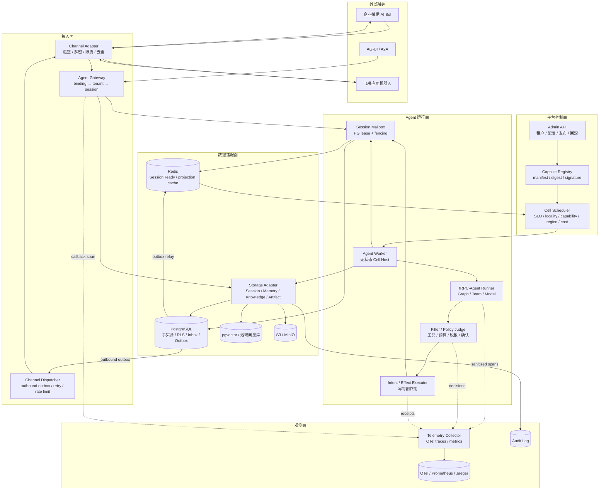
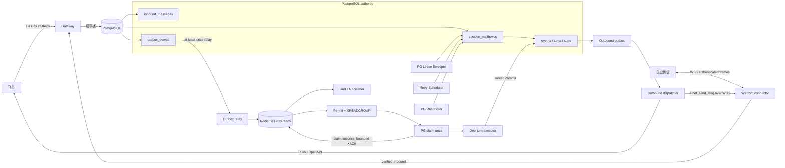

# 架构与消息时序

> 本文保留可靠多租户运行底座。创新层 Agent Capsule、Cell Scheduler、Causal Event、
> Intent/Effect 和 Replay 的完整设计见 [Causal Agent Cell Fabric](agent-cell-fabric.md)。

*Mailbox v2 的运行架构、消息边界和恢复职责。生产默认使用 v2；v1 仅用于受控切换和排空。*

---

## 🧩 平台总图：控制面、运行面与适配面

下面的总图按题目点名的边界命名组件。**Agent Cell 是逻辑身份，Agent Worker 是短生命周期宿主**；
Channel Adapter 处理供应商协议，Storage Adapter 处理租户后端选择，Telemetry Collector 只接收
脱敏后的指标/trace。Admin API 只改变带版本的控制面对象，不直接驱动一次模型执行。



当前默认消息路径是 `Channel Adapter → Agent Gateway → PostgreSQL Mailbox/Outbox → Redis
唤醒 → Agent Worker → tRPC-Agent Runner → Governance/ToolExecutor → Storage Adapter → Channel
Adapter`；Worker 在 turn 边界把真实执行投影到 PostgreSQL Cell Journal，提交后的缺口由
`post_turn.ready` Outbox 驱动的 Projector 补齐。图中的 Semantic Cell Scheduler、
原生 Cell Effect Executor 和反事实 Judge 是目标生产路径：实现与数据库预留协议已提供，但尚未成为
默认 Worker 热路径。Redis 只是可重建通知；租户、Session、事件、Memory/Summary 事实、审计和投递状态的
权威读写仍由 Storage Adapter 选择并落实到 PostgreSQL/对应后端。Telemetry Collector（图中 `TC`）
不得接收原文、Secret 或未脱敏 arguments。

## 🧭 设计结论

本服务把 **PostgreSQL Session Mailbox** 作为调度和执行权的唯一权威，把 Redis
`SessionReady` Stream 作为可丢失、可重复的唤醒层。这样，Redis 不再保存 inbound 任务的
长期所有权，也不再覆盖模型或工具执行周期。

- PostgreSQL 权威保存 `inbound_messages`、`session_mailboxes`、事件、turn、业务状态、审计和 outbox。
- Redis v2 只发送 Session 级唤醒通知，不发送单条 inbound 的正文或业务状态。
- Worker 先取得本地 Executor permit，再 `XREADGROUP`，随后在 PostgreSQL 中只 Claim 一次。
- Claim 成功后立即执行有界 `XACK`，再进入一个 Agent turn；执行期间只续 PostgreSQL Session lease。
- 同一 Session 任何时刻最多只有一个有效的 PostgreSQL lease。`lease_epoch` 是 fencing token，旧 Worker 不能提交。
- Worker 不保存 Session 执行状态，不需要 sticky session；不同 Session 可以并行。

### v2 与 v1 的边界

v2 使用 `trpc:session-ready:v2` / `trpc-session-ready-v2`，Redis 记录的是唤醒信号。
v1 使用 `trpc:inbound:v1` / `trpc-workers-v1`，是兼容排空路径。两套协议不能在同一个
数据库切换窗口内同时处理新消息；具体停入站、排空、切换和回滚顺序见
[Session 调度器 v1/v2 切换运行手册](scheduler-cutover.md)。

## 🗺️ 组件与数据流



`Gateway / connector` 只完成通道验签、解密、binding 路由、配置 revision 固定和短事务。
它在同一 PostgreSQL 事务中按 `(tenant_id, session_id)` 锁定 mailbox，写入去重后的 inbound，
推进 `accepted_sequence`，并在需要从 `IDLE` 进入 `QUEUED` 时写入一个
`session.ready.v2` outbox。消息已经处于 `QUEUED`、`RUNNING` 或 `RETRY_WAIT` 时，不为每条
新 inbound 制造 Redis 竞争通知。

## 🔁 入站到执行的完整时序

```mermaid
sequenceDiagram
    accTitle: SessionReady execution flow
    accDescr: A verified callback commits PostgreSQL mailbox work before a relay publishes a wake-up. A worker claims once, acknowledges the Redis notice, then executes and commits one fenced turn.

    participant im_user as IM user
    participant channel as Channel Adapter
    participant gateway as Agent Gateway
    participant storage as Storage Adapter
    participant postgres as PostgreSQL
    participant relay as Outbox relay
    participant redis as Redis SessionReady
    participant worker as Agent Worker
    participant runner as Agent runner
    participant filter as Filter / Policy
    participant provider as Model / Tool
    participant telemetry as Telemetry Collector

    im_user->>channel: provider callback
    channel->>channel: verify / decrypt / dedupe
    channel->>gateway: verified envelope + binding_id
    gateway->>gateway: resolve binding, tenant, session and immutable revision
    gateway->>storage: resolve tenant/session + pinned revision
    storage->>postgres: BEGIN; lock session_mailbox
    postgres->>postgres: dedupe inbound; append sequence
    postgres->>postgres: IDLE -> QUEUED; generation + 1 when needed
    postgres->>postgres: write session.ready.v2 outbox
    postgres-->>storage: COMMIT
    storage-->>gateway: durable acceptance
    gateway-->>channel: accepted
    channel-->>im_user: 2xx acknowledgement

    relay->>postgres: claim unpublished session.ready.v2 outbox
    relay->>redis: XADD SessionReady
    relay->>postgres: mark published

    worker->>worker: reserve Executor permit
    worker->>redis: XREADGROUP ... > (count=1)
    worker->>storage: claim_session_ready once
    alt claimed
        storage-->>worker: RUNNING + lease_epoch
        worker->>redis: bounded XACK
        worker->>storage: hydrate Session + Memory + Summary
        worker->>runner: execute one Agent turn
        runner->>provider: model request (trace_id/request_id)
        provider-->>runner: result
        runner->>filter: governed Tool call + keyed audit projection
        filter->>provider: legacy fenced ToolExecutor call
        provider-->>filter: effect result / ambiguous + stable effect key
        runner-->>worker: buffered events and final reply
        worker->>storage: fenced commit; events, state, outbound
        worker->>storage: post-commit best-effort Memory/Summary
        storage->>storage: post_turn.ready repairs missing Cell effect/commit facts
        worker-.>>telemetry: sanitized spans / metrics
        gateway-.>>telemetry: callback span
        storage-.>>telemetry: backend latency
    else stale, already running, or empty
        storage-->>worker: STALE / RUNNING / EMPTY
        worker->>redis: bounded XACK
        worker->>worker: release permit; no BUSY sleep
    else database error
        postgres-->>worker: claim error
        worker->>worker: do not ACK; Redis Reclaimer retries handoff
    end
```

成功 Claim 后，`XACK` 只覆盖 `XREADGROUP → PostgreSQL Claim → ACK` 的短交接窗口。
ACK 超时或返回零不会撤销已经提交的 PG Claim；重复通知再次到达时，新的 Claim 会看到
`RUNNING` 或 generation 已过期，直接 ACK 并释放 permit。Worker 不在这个路径中循环
`BUSY → sleep → acquire`。

## 🧾 SessionReady v2 数据契约

Redis v2 的字段固定为以下七项；`event_id` 对应 PostgreSQL outbox 的 `outbox_id`，因此
生产 PostgreSQL Claim 会校验 event、tenant、session 和 generation 的一致性。

| 字段 | 用途 | 是否可作为权威状态 |
|---|---|---|
| `event_id` | outbox 事件身份和 Claim 认证 | 否，权威记录在 PostgreSQL |
| `tenant_id` | 路由和租户隔离 | 否，必须与 PG binding/mailbox 匹配 |
| `session_id` | 唤醒目标 | 否，必须与 PG mailbox 匹配 |
| `generation` | 唤醒版本、幂等和诊断 | 否，不是 lease fencing token |
| `priority` | 调度提示 | 否，不能绕过 mailbox 顺序 |
| `trace_id` | 链路关联 | 否 |
| `created_at` | 通知创建时间 | 否 |

Redis 中禁止放入完整用户消息、Session state、工具结果、Secret、可信身份来源或业务锁。
Worker 必须从 PostgreSQL 重新读取 authoritative inbound、Session snapshot 和配置 revision。

## ♻️ Generation、Claim 和恢复职责

`queue_generation` 描述一次可执行唤醒，不是 Redis owner，也不是执行 lease。状态转移规则是：

| 状态或事件 | PostgreSQL 动作 | Redis/outbox 行为 |
|---|---|---|
| `IDLE → QUEUED` | 接收新工作，generation 加一 | 写新的 `session.ready.v2` |
| `RETRY_WAIT` 到期 | Retry Scheduler 进入 `QUEUED`，generation 加一 | 写新的 `session.ready.v2` |
| 一个 turn 提交后仍有 backlog | 清理 lease，重新 `QUEUED`，generation 加一 | 写新的 `session.ready.v2` |
| 长期 `QUEUED` 且通知疑似丢失 | 保持原 generation | 重开或补回同 generation 的 outbox，不持续制造新行 |
| Redis 重复通知 | PG 校验 event/generation 后只 Claim 一次 | `RUNNING`、`STALE` 或 `EMPTY` 均 ACK |

四个恢复组件的边界必须保持独立：

| 组件 | 只负责什么 | 不负责什么 |
|---|---|---|
| Redis Notification Reclaimer | `XAUTOCLAIM` 恢复尚未完成 Claim/ACK 的短 PEL 窗口 | 不恢复模型执行，不续 Redis 长 lease |
| PostgreSQL Lease Sweeper | 恢复过期 `RUNNING` mailbox，推进 fencing epoch 和唤醒 | 不处理普通 Redis PEL |
| Retry Scheduler | 只处理 `RETRY_WAIT` 且 `retry_at` 到期 | 不在 Worker 内 sleep 重试 |
| PostgreSQL Reconciler | 修复丢通知、非 RUNNING 异常、committed self-heal 和 stale `QUEUED` | 不扫描/接管普通过期 `RUNNING` |

普通过期 `RUNNING` 的扫描和恢复职责由 PostgreSQL lease sweeper 完成；收到经过认证的
SessionReady 时，Claim 事务也可以按同一 fencing 规则直接接管已过期 lease。两条路径都
不能由 Reconciler 反复竞争。模型或工具执行期间可以有 PostgreSQL lease heartbeat，但
绝不保留 Redis PEL heartbeat 或 Redis 长期所有权。

## 🧱 执行、提交与故障边界

Claim 事务提交后不持有数据库事务；执行阶段只在本地保存 turn buffer。最终提交事务按
`session_mailboxes → sessions → session_turns → session_mailbox_items → inbound_messages → events/outbound/outbox`
的顺序获取行并校验 `lease_owner`、`lease_epoch` 和 PostgreSQL 当前时间。旧 Worker 的结果只能得到
fencing conflict，不能写入可见事件或状态。

| 故障位置 | 结果 | 负责恢复者 |
|---|---|---|
| XREADGROUP 后、PG Claim 前 | 通知留在 PEL | Redis Reclaimer |
| PG Claim 已提交、XACK 前 | 重复通知看到 `RUNNING`，ACK 后释放 | Redis 重投 + PG Claim |
| XACK 后、模型执行中宕机 | mailbox lease 到期，旧结果被 fencing | PG Lease Sweeper |
| Redis Stream 丢失 | PG outbox/mailbox 仍在 | Outbox relay + PG Reconciler |
| 模型/工具瞬时失败 | 清理 lease，进入 `RETRY_WAIT` | Retry Scheduler |
| 外部副作用结果未知 | 使用稳定 execution key 和 effect ledger 对账 | 工具治理/人工处理 |

Worker、Gateway、Outbox relay、Recovery service 和 Outbound dispatcher 都可以水平扩展；
正确性不依赖 sticky session。企业微信连接器仍需按 Bot binding 使用 advisory lock 保证
单连接，飞书入口按 HTTP 无状态扩展。

## 🧪 运行验证重点

验收必须分别验证：重复 SessionReady 不会形成 BUSY 抢锁循环；4 个以上 Worker 竞争一个
Session 时只有一个有效 lease；Claim 后立即 ACK 不会让 PEL 年龄接近模型时延；杀死已 ACK
的 Worker 后由 Lease Sweeper 重新排队；Redis 清空后 Reconciler 能按原 generation 重建
通知；不同 Session 可以并行执行。v1/v2 切换的操作门禁见
[scheduler-cutover.md](scheduler-cutover.md)。
