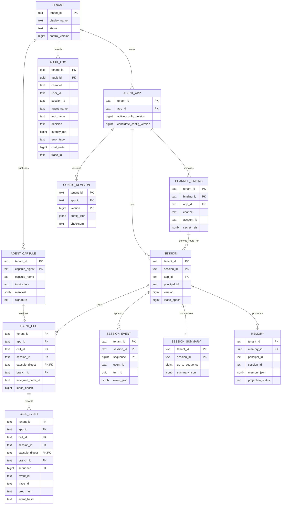

# 数据模型

PostgreSQL 16 + pgvector 是默认权威存储。所有租户表以 `tenant_id` 开头建立复合主键/索引；普通
`trpc_runtime` 不是表 owner，事务先执行 `set_config('app.tenant_id', tenant, true)`，RLS 同时约束读取与
写入。全局 `trpc_worker` 因队列协调显式 BYPASSRLS，必须以专用凭证、tenant-first Repository、完整
namespace 和 fencing 约束，不能借 RLS 作为安全证明。跨租户 binding 解析只允许调用最小权限
`SECURITY DEFINER` 函数，函数固定 `search_path` 且只返回路由所需字段。

## 核心 ER 图

下图抽取题目要求的最小关系，并补充 Capsule/Cell 与投递边界。除 `tenant_id` 外，所有外键均为
tenant-scoped 复合关系；`sessions` 的业务主键仍是 `(tenant_id, session_id)`，而 `0018` 将 Cell
事件流收紧为完整的 `(tenant_id, app_id, cell_id, session_id, capsule_digest, branch_id)` 地址。
`0017` 的短主键只存在于 expand-contract 迁移前半段，不能用裸 ID 跨租户查询。

`session_events` 是已有 turn/session 权威事实流，`cell_events` 是 Cell Fabric 的带 hash-chain 因果
投影。默认 Worker 在模型执行前后用相同 Session owner/epoch 对 Cell append 独立 fencing；数据库
trigger 要求运行中 append 携带当前 lease proof。提交后的 Projector 不能复用已释放 lease，只能在
`session_turns=committed` 且同一完整 Cell stream 已有 `reply.prepared` 时补齐缺失的
`tool.effect.*` / `turn.committed`。`post_turn.ready` 事务 Outbox 负责触发这条补偿链路，两张表不伪装
成一个跨事务事实源，也不重放 Agent。向量、对象存储和 Redis 不在 ER 图中作为权威实体，分别由 `storage_profiles`、
`knowledge_embeddings`、`artifacts` 和投影状态关联。

| 领域 | 表 | 关键约束 |
|---|---|---|
| 控制面 | `tenants`, `agent_apps`, `config_revisions`, `storage_profiles`, `tenant_policies` | revision 不可变；tenant control_version 用 ETag CAS |
| 管理幂等 | `admin_idempotency` | `(tenant_id,idempotency_key)`；请求 hash 不同则 409 |
| 通道 | `channel_bindings`, `channel_identities` | 外部账号只能通过 binding 进入租户；secret 仅存 SecretRef |
| 接入/投递 | `inbound_messages`, `outbound_messages`, `delivery_attempts` | 外部消息唯一键；outbound 保留 pending/sent/failed/ambiguous |
| Session | `sessions`, `session_turns`, `turn_intents`, `session_events`, `session_summaries` | lease_epoch/fencing；event sequence 连续；summary CAS 到 up_to_sequence |
| 长期数据 | `memories`, `artifacts`, `knowledge_items`, `knowledge_embeddings` | PG 元数据权威；向量和对象投影可重建 |
| 运维治理 | `outbox_events`, `dead_letters`, `tool_executions`, `confirmation_challenges`, `audit_logs`, `migration_checkpoints` | 至少一次、人工重放、一次确认和可恢复迁移 |

消息幂等键为 `(tenant_id, channel, account_id, external_message_id)`。Session 保存 `version`、
`next_sequence`、`lease_epoch/owner/expires_at`；turn 保存 pinned `config_version`、attempt、fencing token
和状态。事件使用 `(tenant_id,session_id,sequence)` 主键并以 `event_id` 再去重。

Memory 权威 JSON 先写 PostgreSQL，`projection_status` 驱动 projector 写 pgvector 或外部 Memory。
Knowledge item 与 embedding 分离，固定 profile 的 embedding dimension；不同维度使用独立 profile/DSN。
Artifact 元数据只在临时对象 checksum 验证后提交，object key 使用 tenant hash 命名空间，后台清理无
元数据引用的 staging 对象。

上述是仓库内置 PostgreSQL profile（PG/S3/pgvector）的默认语义。Redis 仅内置为可重建唤醒/投影层；
InMemory、远端向量库和外部 Memory 等替代实现通过 `ProfileServiceFactory` 预注册 bundle 注入，仓库
没有为每一种组合提供已验证的生产实现。

配置 revision 包含模型/fallback、工具策略、预算、通道能力、storage profile、审计策略和 policy
version。消息进入 Inbox 时固定 revision，灰度桶由 Session HMAC 决定，因此同一 Session 的重试不会
漂移。100% 激活和历史 revision 回滚都只更新 `agent_apps` 指针，不修改旧 JSON。

初始 schema 位于 `migrations/versions/0001_production_runtime.py`。后续迁移必须遵循 expand-contract：
先加可空列/新表并双写，滚动升级全部完成后再收紧约束或删除旧结构。

## Agent Cell Fabric 扩展

迁移 `0017_agent_cell_fabric.py` 先增加 Cell/Capsule/Intent/Effect 表，`0018_cell_namespace_and_reservations.py`
再以 expand-contract 完成完整 Cell 地址、branch head CAS、append-only 触发器和节点容量 reservation。
`0019_cell_branch_head_lock.py` 增加仅供 `trpc_worker` 使用的 tenant-bound `SECURITY DEFINER` 行锁入口，
避免为 Worker 扩大 branch-head 表的直接 `UPDATE` 权限。`0020_performance_cell_cleanup.py` 只为精确的
合成性能租户增加 migration-owned、runtime-only 清理入口，`0021_performance_reservation_cleanup.py`
再让它拒绝未过期 active lease、回收已过期/已释放 reservation，并从剩余 active 行重算节点计数；
这些迁移不放宽普通运行时对 `cell_events` 的 append-only 约束。`0022_cell_node_snapshot_generation.py`
为节点快照增加 producer-owned 单调 generation，重复或延迟快照不能覆盖新状态：

| 表 | 作用 | 核心约束 |
|---|---|---|
| `agent_capsules` | 内容寻址、可签名的 Agent 部署/运行证据 | `(tenant_id,capsule_digest)`；`trust_class=deployment/runtime_projection`；只有前者可 placement |
| `agent_cells` | 可移动逻辑 Cell 与 branch/lease 状态 | `(tenant_id,app_id,cell_id,session_id,capsule_digest,branch_id)`；候选分支记录 parent capsule/sequence |
| `cell_events` | append-only 因果事实日志 | 完整 Cell 地址 + 连续 sequence、payload/event/prev hash、request/trace/causation |
| `cell_tool_intents` | Agent 提出的不可变工具意图与策略决策 | intent ID、arguments hash、effect key 均租户隔离 |
| `cell_effect_ledger` | effect key 的唯一执行权与租约状态 | 每个 effect key 一行，lease epoch 防旧执行者完成 |
| `cell_effect_receipts` | 每次确定结果或歧义结果的不可变凭据 | `(tenant_id,effect_key,attempt)` 唯一 |
| `cell_branch_heads` | 每个 branch 的 sequence/hash/lease CAS 头 | 与完整 Cell 地址复合主键；在线 append 传入并由数据库时钟校验 owner/epoch/expiry；`NULL/0/NULL` 仅是活跃 Session proof 下的明确初始化状态 |
| `cell_node_capacity` / `cell_placement_reservations` | 全局节点容量与租户 placement reservation | 节点计数在受控事务中更新；同一租户 Cell 只能有一个 active reservation；快照必须携带持久控制面来源的正整数 `observed_generation`，只接受严格递增值 |
| `cell_approval_nonces` | 高危工具确认的一次性凭据 | tenant + nonce digest 主键；scope/expiry 条件更新后仅可消费一次 |

默认 `trpc_worker` 对在线 Journal 仅持有 `agent_cells`、`cell_events`、`cell_branch_heads` 的必要
`SELECT/INSERT`（以及 Capsule 只读）；它不能直接 `UPDATE` Cell 或 branch head。Worker append 同时
传递 Session/branch lease owner、epoch、expiry，sequence/hash 与 branch mirror 推进由固定
`search_path = pg_catalog, public, pg_temp`（`pg_temp` 最后）的数据库 trigger 完成。native
intent/effect/receipt/approval/reservation 表不授予
默认 Worker 直接权限。启动检查同时验证必需权限存在和危险权限不存在。原生执行面使用单独 provision
的 `trpc_cell_executor` 最小权限账号；当前默认部署未创建该身份，因此原生 Effect 生产门禁保持
`not_run`。

租户 Cell 表通常启用并强制 RLS。`cell_placement_reservations` 是唯一有意的例外：它启用 RLS 保护普通
租户查询但不 `FORCE`，使表 owner 的受控 `SECURITY DEFINER` 调度函数能跨租户回收过期 reservation 并
维护全局节点容量；runtime/Worker 均无直接 DML。全局 Worker 的 `BYPASSRLS` 风险由专用凭证、
tenant-first Repository、完整 namespace、数据库级 Session/committed-turn proof 与显式权限矩阵约束，
而不是由 RLS 本身兜底。

`turn.committed` 与 terminal `tool.effect.*` 的无 branch lease 路径只接受同 stream 的 committed
turn 和 `reply.prepared` 证据；它是恢复/投影证据，不等价于原生 effect intent/ledger。默认 Worker
的外部副作用权威仍是 `tool_executions`，原生 `cell_effect_ledger` 只有独立 executor 写入。
